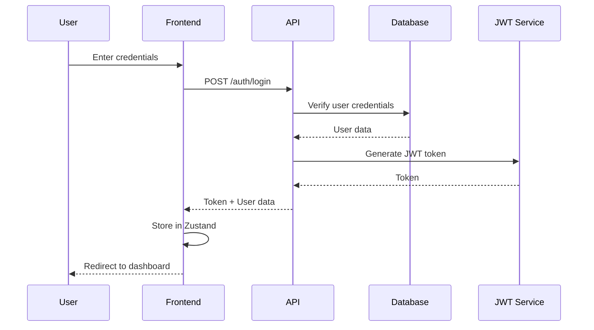
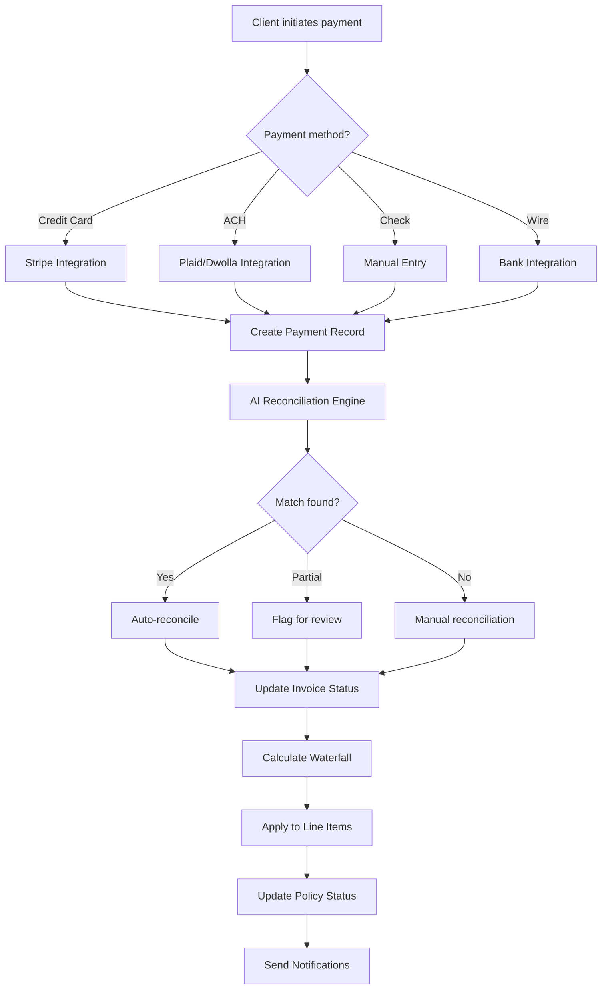
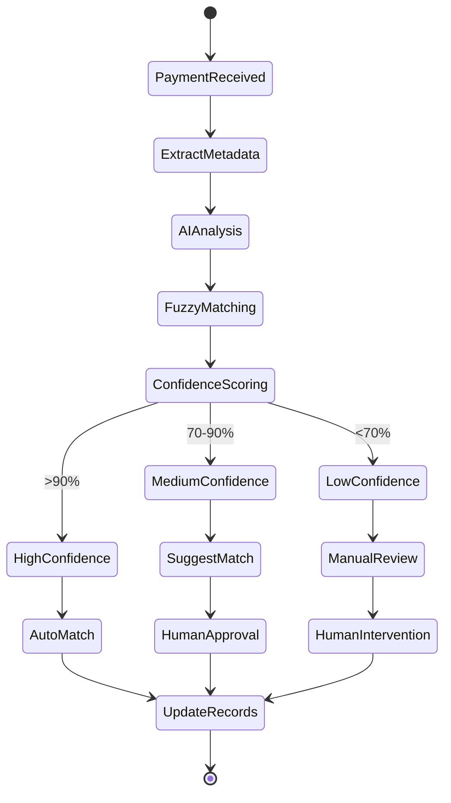
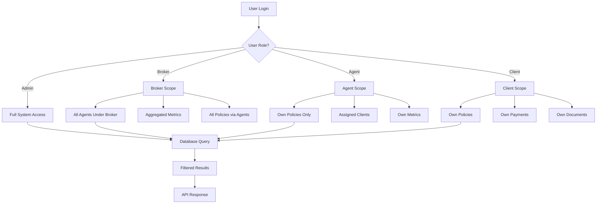
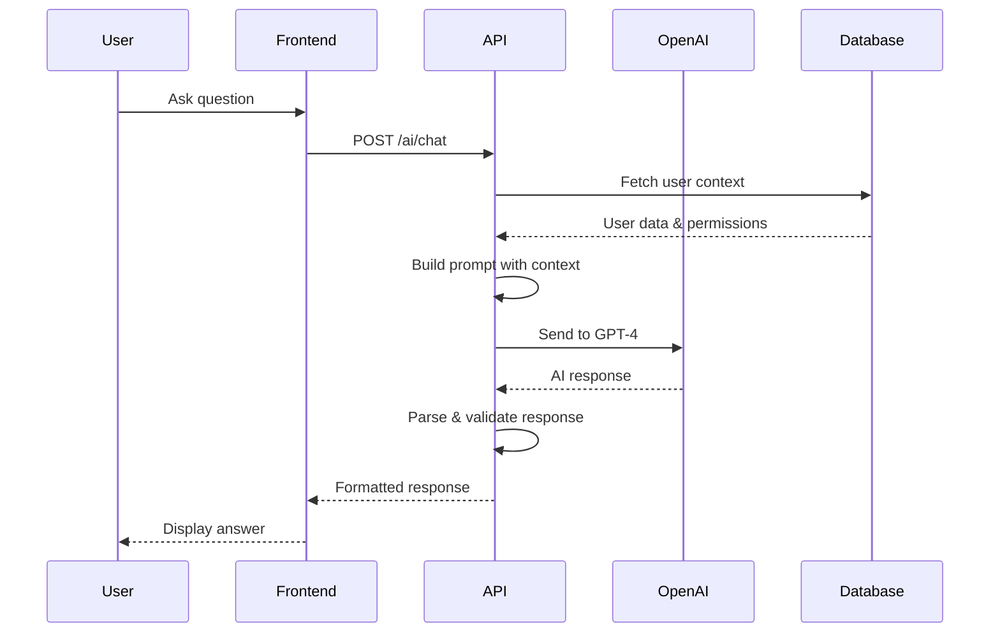
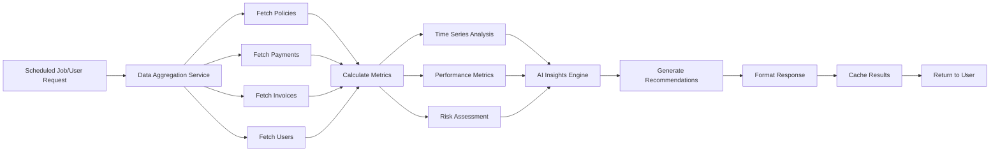
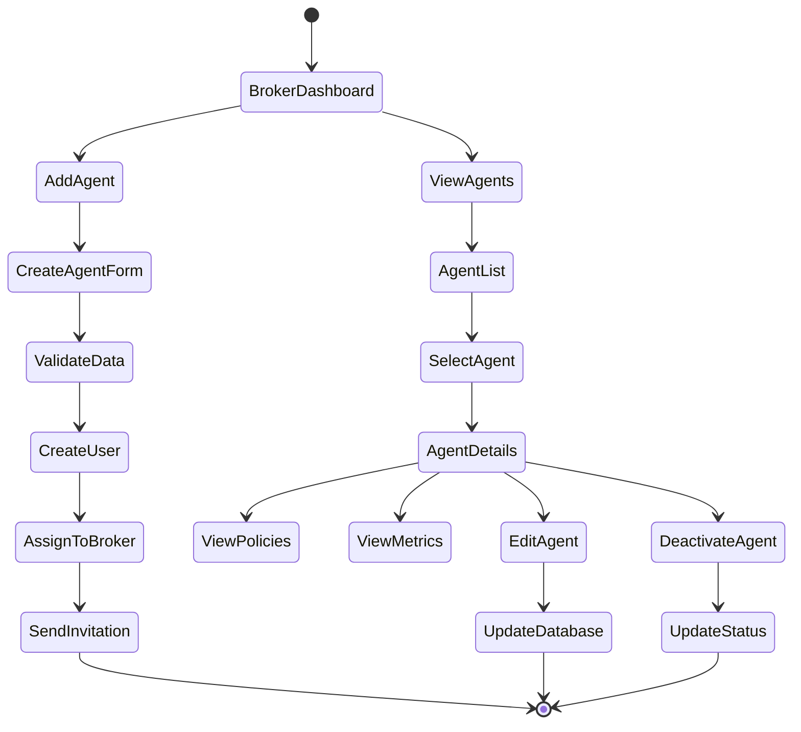
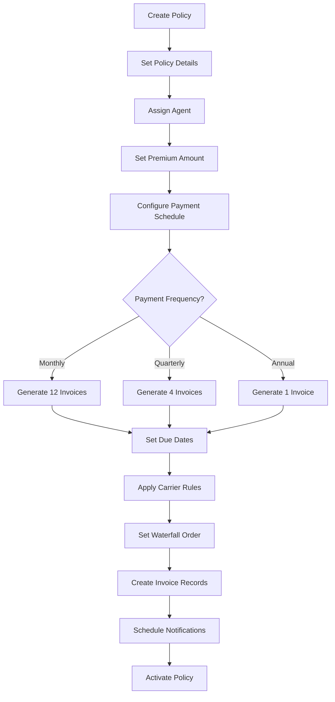
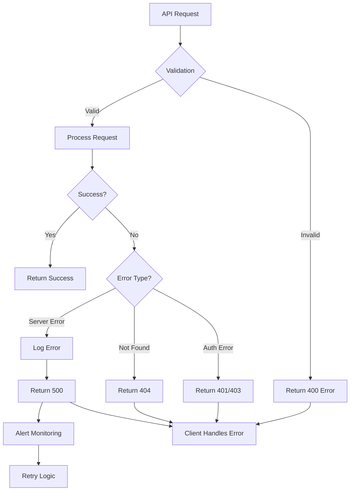
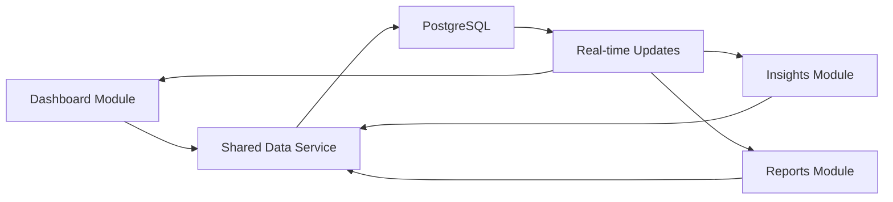

# Paycile System Flow Documentation

## Core Business Process Flows

### 1. User Authentication Flow



### 2. Payment Processing Flow



### 3. AI-Powered Reconciliation Flow



### 4. Payment Waterfall Application

```
Payment Amount: $1,000
Policy Premium: $1,200

Waterfall Priority (Configurable by Carrier):
1. Commission (10%)     → $100
2. Carrier Fee (5%)     → $50
3. Premium Balance      → $850
   
Result:
- Commission Paid: $100
- Carrier Fee Paid: $50
- Premium Paid: $850
- Remaining Due: $200
- Invoice Status: Partially Paid
```

### 5. Role-Based Data Access Flow



### 6. AI Chat Assistant Flow



### 7. Insights Generation Flow



### 8. Agent Management Flow (Broker Perspective)



### 9. Policy Creation & Invoice Generation



### 10. Error Handling & Recovery Flow



## Data Consistency Flows

### Ensuring Metrics Accuracy

```
1. Single Source of Truth
   └── All metrics derived from core tables
   
2. Calculation Pipeline
   ├── Raw Data Query
   ├── Business Logic Application
   ├── Role-Based Filtering
   └── Caching Layer

3. Update Triggers
   ├── Payment Created → Recalculate Revenue
   ├── Policy Updated → Recalculate Counts
   ├── Invoice Paid → Update Collection Rate
   └── Agent Added → Update Agent Metrics
```

### Cross-Module Data Sync



## Security Flows

### API Request Security Flow

```
Request → CORS Check → Rate Limit → JWT Verify → Role Check → Process → Response
   ↓          ↓            ↓            ↓            ↓           ↓          ↓
 Block     Block        Block        Block        Block      Error     Success
```

### Data Encryption Flow

```
User Input → Frontend Validation → HTTPS Transport → API Validation → Bcrypt/Encrypt → Database
                                         ↓
                                   SSL/TLS 1.3
```

---

*These flow diagrams represent the core business processes and technical implementations within the Paycile platform.* 